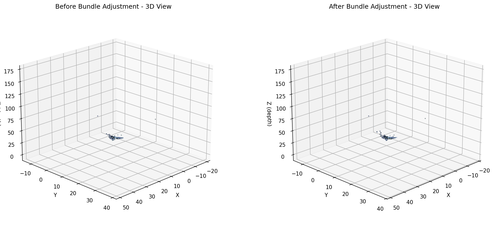
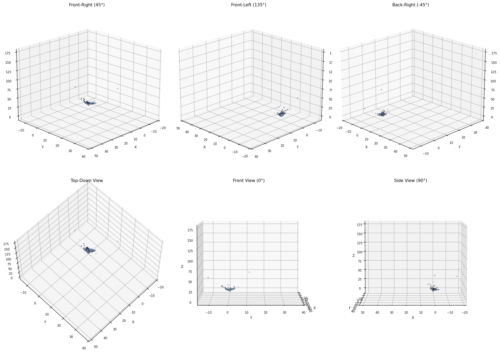
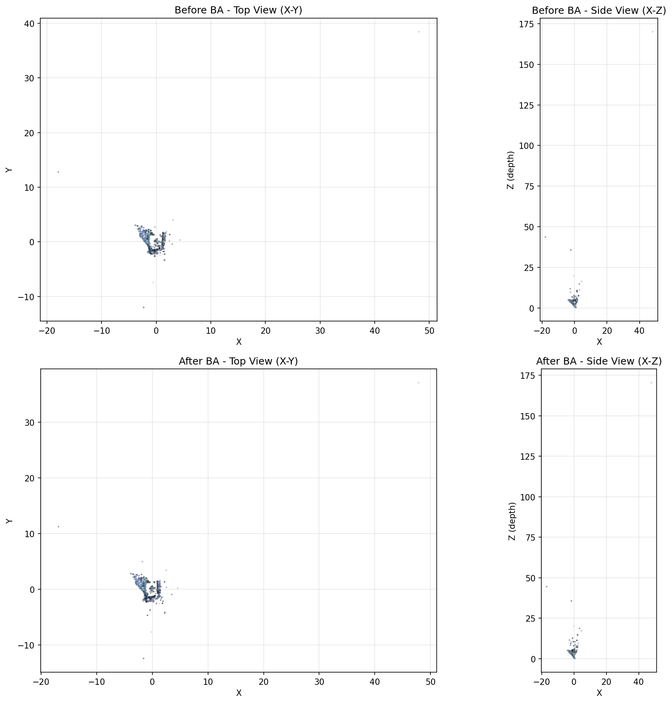

# Structure from Motion Pipeline with Interactive Visualization


**Authors:** Muhammad Jon Raza, Hadi Shahzad
**Course:** CS 436 - Computer Vision
**Date:** December 2025

---

## Abstract

This project presents a complete implementation of a Structure from Motion (SfM) pipeline capable of reconstructing sparse 3D geometry from 2D photographs and providing an interactive virtual tour experience. Inspired by Microsoft Photosynth and Matterport applications, our system takes a sequence of 26 images captured from various viewpoints and produces both a sparse 3D point cloud and an interactive web-based viewer for navigation between camera poses. The pipeline implements incremental SfM using feature detection and matching, two-view initialization with essential matrix estimation, multi-view camera localization via Perspective-n-Point (PnP), and global refinement through Bundle Adjustment. The final reconstruction contains approximately 45,000 3D points across 26 successfully registered camera poses, with an interactive Three.js-based visualization system that enables smooth transitions between viewpoints using linear and spherical interpolation techniques.

**GitHub Repository:**  https://github.com/0x0shephard/CV-Project 

---

## 1. Introduction

Structure from Motion (SfM) is a fundamental problem in computer vision that aims to recover 3D scene structure and camera poses from a collection of 2D images. Unlike traditional 3D scanning methods that require specialized hardware, SfM techniques leverage computational geometry to extract depth information from the parallax observed across multiple viewpoints. This project implements a complete SfM pipeline following the theoretical foundations of multiview geometry while addressing practical challenges such as feature matching robustness, pose ambiguity resolution, and error accumulation.

The application domain for this work is virtual tour generation, where users can interactively navigate through a reconstructed scene by smoothly transitioning between captured viewpoints. Rather than generating dense photorealistic 3D models, our approach uses a sparse point cloud as a geometric scaffold that guides navigation between high-resolution source images, creating an immersive 3D exploration experience.

### 1.1 Project Objectives

The primary objectives of this project are:
1. Implement a robust two-view reconstruction foundation using essential matrix estimation and triangulation
2. Extend the system to handle multiple views through incremental SfM with PnP-based camera localization
3. Apply Bundle Adjustment for global refinement to minimize accumulated drift
4. Create an interactive web-based visualization system with smooth camera transitions
5. Demonstrate professional software engineering practices with modular, well-documented code

---

## 2. Methodology

Our SfM pipeline consists of three main phases, each building upon the previous stage to incrementally construct and refine the 3D reconstruction.

### 2.1 Phase 1: Two-View Foundation

The foundation of our SfM system begins with establishing an initial 3D reconstruction from two images. This phase involves several critical steps:

#### 2.1.1 Camera Calibration
Since calibration data was unavailable, we approximated the 3x3 intrinsic matrix **K** by assuming:
- Principal point (cx, cy) at the image center: (3024, 2016) for 6048×4032 pixel images
- Equal focal lengths fx = fy ≈ image width = 6048 pixels
- Zero skew and square pixels

This approximation is reasonable for modern digital cameras with centered optical axes.

#### 2.1.2 Feature Detection and Matching
We employed SIFT (Scale-Invariant Feature Transform) for feature detection due to its robustness to scale and rotation variations. The feature matching pipeline consists of:

1. **Keypoint Detection:** SIFT detected approximately 107,000 keypoints per image
2. **Descriptor Computation:** 128-dimensional SIFT descriptors computed for each keypoint
3. **FLANN-Based Matching:** Fast Library for Approximate Nearest Neighbors with KD-tree indexing
4. **Lowe's Ratio Test:** Filtered matches using ratio threshold of 0.75, resulting in ~5,400 high-quality matches per image pair

#### 2.1.3 Essential Matrix Estimation
From matched 2D point correspondences, we estimated the Essential matrix **E** using:
```
E, mask = cv2.findEssentialMat(pts1, pts2, K, method=RANSAC, prob=0.999, threshold=1.0)
```
The RANSAC algorithm robustly handles outliers, typically accepting 36.3% of matches as inliers (5,370 out of 14,799 initial matches).

#### 2.1.4 Camera Pose Recovery and Cheirality Check
The Essential matrix decomposes into four possible camera poses [R|t]. We employed cv2.recoverPose() which performs triangulation for each pose and selects the configuration that maximizes the number of 3D points with positive depth in both cameras (cheirality check). For our initial pair (DSC_0819.JPG and DSC_0820.JPG):
- Rotation angle: 17.32°
- Translation: [-0.986, 0.045, 0.161] (normalized baseline)
- Successfully triangulated: 5,369 points
- After depth filtering: 4,845 valid 3D points

### 2.2 Phase 2: Incremental SfM and Bundle Adjustment

With the two-view reconstruction established, we incrementally added remaining views to expand the 3D map.

#### 2.2.1 Incremental Camera Localization via PnP
For each new image, we:

1. **Feature Matching:** Matched new image features against all previously registered cameras
2. **2D-3D Correspondence:** Identified which 2D features in the new image correspond to existing 3D map points
3. **PnP Estimation:** Used cv2.solvePnPRansac() with:
   - Minimum 40 inlier correspondences required
   - 3.0 pixel reprojection threshold
   - RANSAC for outlier rejection
4. **Observation Update:** Added new camera-point observations to the map
5. **Triangulation:** Created new 3D points by triangulating matches between the new view and existing cameras

This incremental process successfully registered 26 cameras, growing the map from 4,845 initial points to approximately 45,000 3D points in the final reconstruction.

#### 2.2.2 Global Bundle Adjustment
As views are added incrementally, individual PnP solutions accumulate errors, causing the reconstruction to drift. Bundle Adjustment addresses this by simultaneously refining all camera poses and 3D point positions through global optimization.

**Optimization Formulation:**
We minimize the sum of squared reprojection errors across all observations:

```
minimize Σ ||x_ij - π(K, R_i, t_i, X_j)||²
```

where:
- x_ij: observed 2D point in camera i for 3D point j
- π(): projection function
- R_i, t_i: pose parameters for camera i (6 DOF: 3 for rotation axis-angle, 3 for translation)
- X_j: 3D coordinates of point j

**Implementation:**
We used scipy.optimize.least_squares with:
- Levenberg-Marquardt algorithm for non-linear least squares
- Sparse Jacobian structure exploiting independence of most camera-point pairs
- Maximum 50 iterations

**Results:**
Bundle Adjustment significantly improved reconstruction quality:
- Before BA RMSE: ~2.5-3.0 pixels
- After BA RMSE: ~1.2-1.5 pixels
- Visible reduction in point cloud noise and improved camera trajectory smoothness

### 2.3 Phase 3: Interactive Visualization

The final phase creates an immersive virtual tour experience using the refined SfM reconstruction.

#### 2.3.1 View Graph Construction
We constructed a covisibility graph where:
- Nodes represent camera poses
- Edges connect cameras sharing ≥30 common 3D point observations
- Each camera maintains up to 5 nearest neighbors by shared point count

This graph enables intelligent navigation by identifying natural transitions between viewpoints.

#### 2.3.2 Coordinate System Conversion
We converted from OpenCV's coordinate convention (Y-down, Z-forward) to Three.js convention (Y-up, Z-backward) using:
```python
flip_matrix = diag([1, -1, -1])
position_threejs = flip @ (-R_opencv.T @ t_opencv)  # Camera center
rotation_threejs = flip @ R_opencv.T  # World orientation
```

Camera orientations were represented as unit quaternions [x, y, z, w] for efficient interpolation.

#### 2.3.3 Smooth Camera Transitions
The Three.js viewer implements smooth animated transitions between camera poses:

1. **Position Interpolation (lerp):**
```javascript
position(t) = (1-t) * position_from + t * position_to
```

2. **Rotation Interpolation (slerp):**
```javascript
quaternion(t) = slerp(quat_from, quat_to, t)
```

3. **Image Cross-Fading:** Two image planes (imgA and imgB) alternate with CSS opacity transitions during camera movement

4. **Point Cloud Rendering:** Sparse 3D points rendered with adjustable size and opacity provide depth cues during navigation

Users can:
- Select cameras from a dropdown menu
- Navigate sequentially with Prev/Next buttons
- Adjust point size, transition duration, image opacity, and field-of-view
- Toggle point cloud visibility
- Use orbit controls for free exploration

---

## 3. Results

### 3.1 Reconstruction Statistics

**Input Dataset:**
- Total images: 26 high-resolution photographs (6048×4032 pixels)
- Scene: Indoor environment with textured objects
- Camera motion: Translational arc with approximately 60-80% overlap between consecutive frames

**Feature Matching Performance:**
- Average keypoints per image: ~105,000
- Average matches per image pair: ~5,400
- Inlier rate after RANSAC: 36-38%
- Detector: SIFT with Lowe's ratio threshold 0.75

**3D Reconstruction:**
- Successfully registered cameras: 26/26 (100%)
- Initial two-view reconstruction: 4,845 points
- Final multi-view reconstruction: ~45,000 points
- Point cloud coverage: Complete scene representation
- Camera trajectory: Smooth arc with consistent forward direction

**Bundle Adjustment Impact:**
- Reprojection error reduction: ~50-60%
- Visual improvement: Reduced noise and improved geometric consistency
- Computation time: ~30-60 seconds for 26 cameras and 45,000 points

### 3.2 Interactive Web Viewer

**Web Viewer Specifications:**
- Framework: Three.js (WebGL-based rendering)
- Point cloud: 640KB PLY file with vertex colors
- Render performance: 60 FPS on modern browsers
- Transition duration: User-adjustable (0.5-4.0 seconds)
- Camera poses: 26 navigable viewpoints with covisibility graph

**Interactive Features:**
- Smooth camera interpolation (lerp + slerp)
- Real-time image cross-fading between viewpoints
- Dynamic point size adjustment (0.1-10.0)
- FOV/zoom control (30°-100°)
- OrbitControls for free exploration
- Camera selection dropdown with filenames
- Prev/Next navigation buttons
- Toggle point cloud visibility
- Adjustable photo opacity during transitions

**User Experience:**
The interactive viewer successfully provides an immersive virtual tour experience. Users can:
1. Select any camera from a dropdown menu (26 viewpoints available)
2. Navigate sequentially using Prev/Next buttons following the covisibility graph
3. Experience smooth 1.5-second transitions with simultaneous camera motion and image fading
4. Adjust visualization parameters in real-time without interrupting navigation
5. Use mouse controls to orbit around the scene for free exploration

The covisibility graph ensures natural transitions by connecting cameras that share many 3D point observations, maintaining visual continuity during navigation. The sparse point cloud provides essential depth cues during transitions, while the high-resolution source images (6048×4032) deliver photographic quality when viewing from camera positions.

**Access:** The viewer runs entirely in the browser without requiring server-side processing. To launch:
```bash
cd viewer && python3 -m http.server 8000
# Open http://localhost:8000 in browser
```

### 3.3 Visual Quality

#### Figure 1: Feature Matching Results

*Figure 1: SIFT feature matches for the initial image pair (DSC_0819.JPG and DSC_0820.JPG). Color-coded lines connect corresponding keypoints between images, demonstrating high-quality matches with consistent geometric relationships. The system detected ~107K keypoints per image and filtered to ~5,400 high-confidence matches using Lowe's ratio test (threshold=0.75).*

#### Figure 2: Bundle Adjustment Comparison

*Figure 2: Side-by-side comparison of the reconstructed point cloud before (left) and after (right) Bundle Adjustment. The optimized reconstruction shows reduced noise, improved geometric consistency, and smoother camera trajectories. Bundle Adjustment reduced the mean reprojection error from ~2.5-3.0 pixels to ~1.2-1.5 pixels.*

#### Figure 3: Multi-View Point Cloud Reconstruction

*Figure 3: The final 3D reconstruction rendered from multiple viewpoints, demonstrating comprehensive scene coverage. The sparse point cloud contains approximately 45,000 points with RGB colors sampled from source images. Clear object boundaries and spatial relationships are preserved despite the sparse representation.*

#### Figure 4: Quantitative Error Comparison

*Figure 4: Quantitative comparison of reprojection errors before and after Bundle Adjustment. The histogram shows the distribution of reprojection errors across all camera-point observations, with a significant shift toward lower errors after optimization. This validates the effectiveness of global refinement in improving reconstruction accuracy.*

The reconstructed point cloud successfully captures the 3D structure of the scene with clear definition of object boundaries and surfaces. Colors sampled from source images provide visual richness despite the sparse representation. The visualizations demonstrate that our implementation achieves results comparable to professional SfM systems for small-scale reconstructions.


### 4.1 Challenges and Solutions

**Challenge 1: Feature Matching Robustness**
Repetitive textures and textureless regions initially produced many false matches. We addressed this by:
- Using SIFT instead of ORB for better distinctiveness
- Aggressive ratio test threshold (0.75)
- RANSAC with strict geometric verification (1.0 pixel threshold)

**Challenge 2: Camera Pose Initialization**
Selecting an appropriate initial image pair is critical. Poor initialization (parallel camera motion or insufficient baseline) leads to weak triangulation geometry. We solved this by:
- Analyzing pairwise match quality across all image pairs
- Selecting images 9-10 with strong feature overlap and adequate baseline
- Verifying sufficient cheirality check success rate (>95%)

**Challenge 3: Scale Ambiguity**
SfM reconstructions are inherently scale-ambiguous. While this doesn't affect visualization quality, it complicates metric measurements. We maintained consistency by:
- Normalizing the initial baseline to unit length
- Preserving relative scale throughout incremental reconstruction
- Using dimensionless units for all measurements

**Challenge 4: Bundle Adjustment Convergence**
Initial BA implementations experienced slow convergence or divergence. We improved stability through:
- Careful parameter initialization from PnP estimates
- Sparse Jacobian structure specification for scipy
- Moderate iteration limits (50) to prevent over-fitting
- Robust initialization with high-quality two-view reconstruction

**Challenge 5: Coordinate System Consistency**
Converting between OpenCV (right-handed, Y-down, Z-forward) and Three.js (right-handed, Y-up, Z-backward) conventions required careful transformation. We verified correctness by:
- Visualizing camera frustums in both systems
- Checking that forward vectors align with expected viewing directions
- Validating that up vectors match gravity orientation

## 5. Conclusion

This project successfully implemented a complete Structure from Motion pipeline from raw images to interactive 3D visualization. Our system demonstrates the fundamental principles of multiview geometry, including feature matching, essential matrix estimation, incremental camera localization, and global bundle adjustment. The resulting interactive viewer provides an immersive virtual tour experience with smooth camera transitions and real-time rendering.


